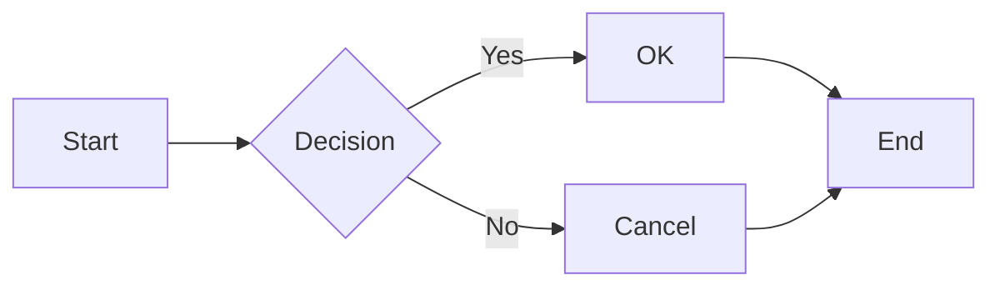
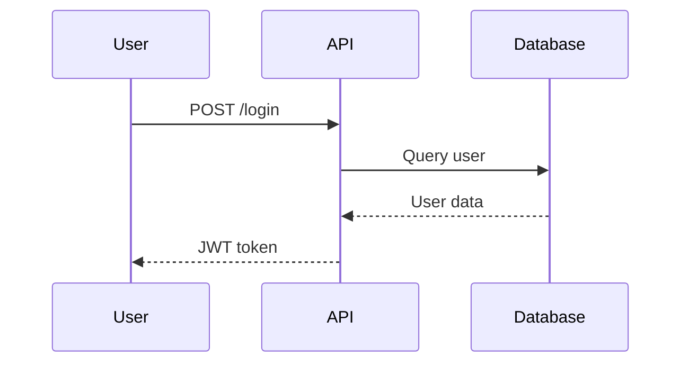
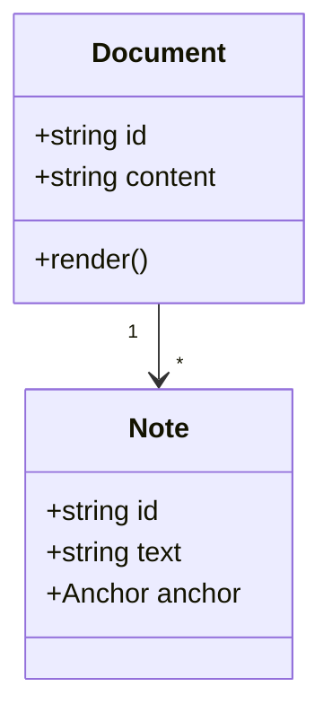
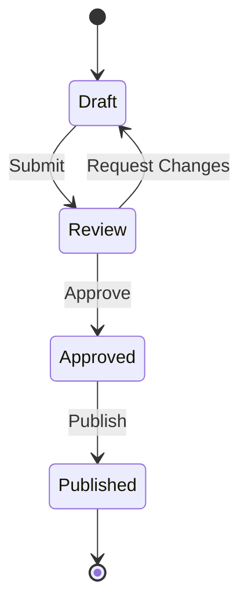
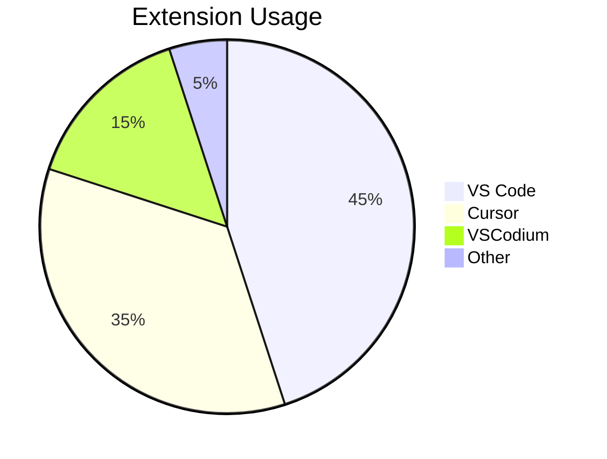

# Mermaid Diagram Test

This document tests the Mermaid diagram rendering feature in Commentary.

## Flowchart



## Sequence Diagram



## Class Diagram



## State Diagram



## Pie Chart



## Invalid Mermaid (should show error)

```mermaid
this is not valid mermaid syntax
and should display an error message
```

## Regular Code Block (should still work)

```typescript
function hello(name: string): string {
  return `Hello, ${name}!`;
}
```
